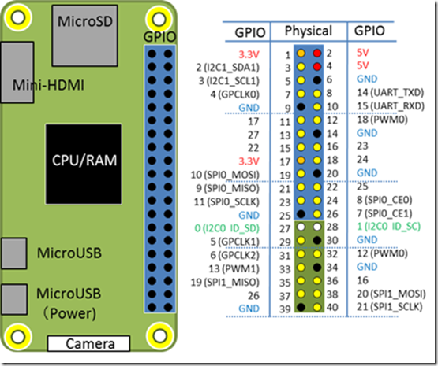
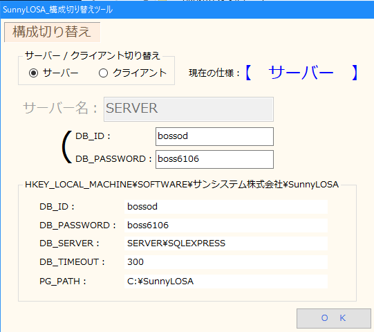

# Raspberry Pi Zero

## bluetoothについて

測距センサはラズパイゼロのGPIOの2,6,21を使用しています。抜けてしまった場合は黒が__2__、オレンジが__6__、白が__21__に接続してください。



[https://bcn.xsrv.jp/wp-content/uploads/image_thumb-35.png](https://bcn.xsrv.jp/wp-content/uploads/image_thumb-35.png)

## 診察番号の探索について

ラズパイとSummyLOSAのサーバー側のPC、ロボホン は同一のWi-Fiに接続してください。

特にロボホン はスリープ状態から戻すとWi-Fiが切れている場合が稀にあるので注意が必要でした。

### サーバのエンドポイント
```
患者の情報を返す
http://rasp0.local/Patient/<patient_id>

診察番号の情報を返す
http://rasp0.local/Appoint/<kanja_id>

DBのデータベース名をリスト表示
http://rasp0.local/List
```

### SummyLOSAのサーバーIDやPASSWORDを変更した場合

ラズパイにログインする必要があるので以下でログインします。

```
ssh pi@rasp0.local 
```

メンテナンスツールで設定をしたDB\_IDとDB\_PASSWORDをそれぞれ"DB\_ID"と"DB\_PASSWORD"と変えて下記のコマンドを実行します。

```
echo export SUNNY_USER="DB_ID" >> ~/.bash_profile
echo export SUNNY_PASSWORD="DB_PASSWORD" >> ~/.bash_profile
```




